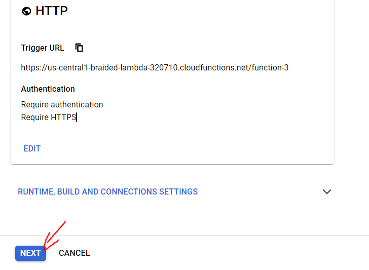

This repo has source code and steps for deploying sentence comparision function to google cloud function.

# Files:
function-source.zip
We will upload this zip file to gcloud function.
This zip has main.py and requirements.txt file  <br/>

main.py This file is for you reference and has the actual code for sentence comparision.  <br/>

requirements.txt This file has the required python packages and their version for cloud function environment. When cloud function getting deployed, it will install packages mentioned in this file.

# The steps to deploy in Google cloud function as below:

1. Signup for Google cloud platform account. There is free credit of 300$ for new signups. After signup and login, the home screen will like this,


2. Click on "Search" as shown below,


3. Type "Cloud run" and click on Click on "Cloud Run API" from search suggestion


4. Enable Cloud run API.
 

5. Click on back button.
 

6. Type "function" in Search box and click on "Cloud Functions" in suggestions.
 

7. Click on "CREATE FUNCTION"
 

8. Now you can see the form to create cloud function. Enter "Function name". Select "Region", this is automatically selected. 
 

9. Select "Trigger" type as "HTTP". Select "Require Authentication". Check "Require HTTPS". Click on "save".
 

10. Click on next.
 

11. Next screen will show like this.
 

12. Select Runtime as "Python 3.7" and entry point as "sentence_compare". "sentence_compare" is the main function in main.py
 

13. Select Zip
 

14. Browse function_source.zip file and select storage bucket.
 

15. It should look like this after selecting zip file and storage bucket. 
 

16. Click on Deploy
 

17. It will show, "function-3" currectly deploying with a circle running to the left
 

18. If deploy is success then you will see green check mark.
 

19. Click on function "function-3". It will show details of "function-3" cloud function. 
 

20. Click on "Trigger" tab. This is the API url for this cloud function.
 

21. As we enbaled authentication while creating cloud function, we have to generate the auth key for this API. We will use this auth key with the API url. To generate auth key lets go to cloud shell.
 

22. Run the below command in gcloud shell,
```shell
gcloud auth print-identity-token
```
 

23. Click on Authorize, when asked. You will get a long string, use this token as your Basic auth .
 

24. If gcloud login not happened, then you may see error like this
 

25. Enter below command to login to "gcloud"
```shell
gcloud auth login
```
It will generate a URL for you. Click on the URL and login with your cloud account
 

26. One login successful, it will show a code, copy this code
 

27. Paste the copied code in glcoud shell as below
 

28. Then again enter the first auth command as below,
```shell
gcloud auth print-identity-token
```
 

29. Copy the autherization token generated above.
 

30. Run the script call_api_with_bearer_auth.py
Edit the "url" which is cloud function "Trigger URL".
In "payload" pass the input josn.
In "headers", in "Authorization" paste the auth key from gcloud shell after "Bearer" as shown in code below.
The code for calling API as below. 
Replace "******" with the auth code you copied from cloud shell.

```python
import requests
import json

url = "https://us-central1-braided-lambda-320710.cloudfunctions.net/function-3"

payload = json.dumps({
  "given_answer": "Although rose you feel pain now",
  "correct_answer": "All right, Ross. Look, you're feeling a lot of pain right now"
})
headers = {
  'Authorization': 'Bearer ******',
  'Content-Type': 'application/json'
}

response = requests.request("POST", url, headers=headers, data=payload)

print(response.text)

```

The result as below,
 


31. You can also test this in google cloud itself,
When in "function-3" window, click on "TESTING" tab, enter the input JSON object and click on "TEST THE FUNCTION".
 

32. You can see the cloud function results as below,
 

33. You can also test this in POSTMAN. <br/>
Select "POST" <br/>
Enter the "Trigger URL" in url section. <br/>
Click on "Authorization". <br/>
Select "Bearer Token" from drop down. <br/>
Click on "Body", select "raw", select "JSON"
Paste the input json in the body section. <br/>
Click on "SEND"

 

34. You can the response from google cloud function as below,
